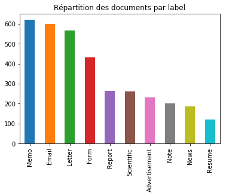
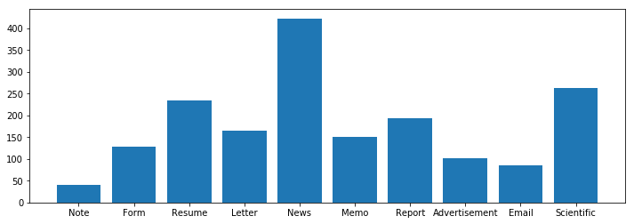

# Tobacco Documents Classification

# Mathieu VANDECASTEELE - MASTER SID 2018-2019

## Université de Rouen

Joint à ce rapport : scripts Python

Ce rapport a pour but de rapporter l'étude de la classification des types des différents documents émis lors des procès contre les industries du tabac aux États-Unis.
Selon une approche projet de Machine Learning, il s'agit de prendre en main les données et de trouver le meilleur classifier possible.

Plan de l'étude :
* Description statistique et analyse du jeu de données
* Découpe / Préparation / Pré-Traitement des données
* Apprentissages de classifiers
* Conclusion, dernières analyses et Pistes d'amélioration

# 1. Analyse des données

## 1.1 Premières statistiques

L'État américain a collecté plus de 14 millions de documents, ici nous disposons d'un échantillon de 3482 éléments précisément. 
Nous devons établir un classifier de documents, nous avons 10 types différents à différencier : Email, Advertisement, Form, Letter, etc.
Première constatation dans un premier temps : 3482 données ce n'est pas beaucoup, cela pourra plus tard poser des problèmes, surtout pour une classification multi-classes.

Nous disposons comme données d'un .csv avec l'image_path et le label associé pour chacune. Nous disposons également des textes de ces images obtenus par OCR.


Ouvrons le .csv avec Pandas et vérifions si on a bien 3482 données et s'il ya bien 10 labels différents :

<div>
<style scoped>
    .dataframe tbody tr th:only-of-type {
        vertical-align: middle;
    }

    .dataframe tbody tr th {
        vertical-align: top;
    }

    .dataframe thead th {
        text-align: right;
    }
</style>
<table border="1" class="dataframe">
  <thead>
    <tr style="text-align: right;">
      <th></th>
      <th>img_path</th>
      <th>label</th>
    </tr>
  </thead>
  <tbody>
    <tr>
      <th>count</th>
      <td>3482</td>
      <td>3482</td>
    </tr>
    <tr>
      <th>unique</th>
      <td>3482</td>
      <td>10</td>
    </tr>
    <tr>
      <th>top</th>
      <td>Scientific/10073624.jpg</td>
      <td>Memo</td>
    </tr>
    <tr>
      <th>freq</th>
      <td>1</td>
      <td>620</td>
    </tr>
  </tbody>
</table>
</div>

Il semble y avoir 3482 éléments également contenus dans les dossiers de textes obtenus par OCR donc on a pas de problèmes de cohérences de nombres de données entre le .csv et ces dernières.

## 1.2 Répartition des données

Analysons la répartition des données avec quelques statistiques descriptives. Tout d'abord piochons 10 données au hasard pour établir une première observation :
```python
data.sample(10)
```

<div>
<style scoped>
    .dataframe tbody tr th:only-of-type {
        vertical-align: middle;
    }

    .dataframe tbody tr th {
        vertical-align: top;
    }

    .dataframe thead th {
        text-align: right;
    }
</style>
<table border="1" class="dataframe">
  <thead>
    <tr style="text-align: right;">
      <th></th>
      <th>img_path</th>
      <th>label</th>
    </tr>
  </thead>
  <tbody>
    <tr>
      <th>3013</th>
      <td>Report/514120277.jpg</td>
      <td>Report</td>
    </tr>
    <tr>
      <th>614</th>
      <td>Email/2085542332c.jpg</td>
      <td>Email</td>
    </tr>
    <tr>
      <th>642</th>
      <td>Email/2085761260b.jpg</td>
      <td>Email</td>
    </tr>
    <tr>
      <th>3109</th>
      <td>Resume/40005130-5131.jpg</td>
      <td>Resume</td>
    </tr>
    <tr>
      <th>590</th>
      <td>Email/2085134821a.jpg</td>
      <td>Email</td>
    </tr>
    <tr>
      <th>2881</th>
      <td>Report/502339200+-9201.jpg</td>
      <td>Report</td>
    </tr>
    <tr>
      <th>722</th>
      <td>Email/527862259+-2259.jpg</td>
      <td>Email</td>
    </tr>
    <tr>
      <th>2909</th>
      <td>Report/504330344_504330348.jpg</td>
      <td>Report</td>
    </tr>
    <tr>
      <th>2011</th>
      <td>Memo/2024072051_2024072053.jpg</td>
      <td>Memo</td>
    </tr>
    <tr>
      <th>827</th>
      <td>Email/81887335.jpg</td>
      <td>Email</td>
    </tr>
  </tbody>
</table>
</div>

Il semble y avoir plus d'emails que d'autres types de documents dans notre jeu de données. On note aussi en relançant la commande que pas mal de lettres ou encore de memos sont présents. Avons-nous une sur-représentation d'une ou plusieurs classe(s) particulière(s) ?

On peut tracer le diagramme bâtons du nombre de documents par type de documents :





Nous avons bel et bien 4 classes supérieures en nombre de données aux autres mais nous ne pouvons pas vraiment parler de sur-représensation.
Le nombre de données restant globalement faible, si les résultats après apprentissage automatique de classifiers ne sont pas satisfaisants, augmenter le nombre de données serait une première piste d'amélioration.

## 1.3 Statistiques Textuelles sur les classes

À partir des données OCR, **étudions le nombre de mots moyens par type de document :**



Il apparaît surtout que les documents du type "News" sont plus longs que les autres. On dénote beaucoup plus de mots, jusqu'à 2 à 4 fois plus que certains autres types de documents.

# 2. Découpe des données

Sur le 3482 données, nous choisissons de découper nos données de manières à pouvoir réaliser toutes les opérations que l'on souhaite faire, c'est à dire :

* Un premier découpage de 60% de données d'entraînement et de 40% de données de test.
* Ces données de test peuvent être divisées en deux pour créer un set de validation.
* On crée un set "trainval" qui est un set concaténant le set d'entraînement et le set d'évaluation. Parfois, on utilisera ce set pour l'entraînement à la place du set de train car nous procèderons à des cross-validations qui découpent automatiquement le données.

    * taille de train : 2089
    * taille de val : 696
    * taille de trainval : 2785
    * taille de test : 697


# 3. Tokenizations et Entraînements

Il y a plusieurs façons de représenter les mots pour l'analyse de Texte. On peut utiliser une approche Bag of Words simple ou alors Bag of Words avec TF-IDF appliquée qui a tendance à mettre plus en avant les mots importants par un système de pondération. 
Dans notre étude nous réaliserons des classifiers pour les deux approches.
Avant Tokenization, tous les textes sont récupérés et nettoyés de ponctuation, sauts de lignes, caractères spéciaux, etc...

Note : Les 10 Labels ont été encodés avec LabelEncoder(). Voici les équivalents :

0 : Advertisement
1 : Email
2 : Form
3 : Letter
4 : Memo
5 : News
6 : Note
7 : Report
8 : Resume
9 : Scientific

## 3.1 MultinomialNB - TF-IDF

Nous décidons d'entraîner un premier classifier simple avec TF-IDF. Il s'agit d'un classifier relativement simple avec un seul hyper-paramètre à optimiser.

   Taille du vocabulaire :
    77566
 
 On ne définit pas de max_features pour le moment, on verra par la suite si on attribue une valeur ou non.

### 1er entraînement :

Réalisons un entraînement simple sans toucher l'hyper-paramètre alpha :

    Evaluation par Cross-Validation (5) avec alpha = 1.0 :
    0.4692737729575612
    
    Précision/Score sur les données de Test : 
    0.5150645624103299
    
    Matrice de Confusion :
    [[  6   0   0   0   0   0   0   0   0   0]
     [  0 112   0   0   0   1   1   0   0   0]
     [  3   0  38   0   0   6   7   1   0   7]
     [ 13   9   7  94  11  28   4  15  21  23]
     [ 23  15  38  29 107   5  29  19   0  23]
     [  0   0   0   0   0   0   0   0   0   0]
     [  0   0   0   0   0   0   0   0   0   0]
     [  0   0   0   0   0   0   0   0   0   0]
     [  0   0   0   0   0   0   0   0   2   0]
     [  0   0   0   0   0   0   0   0   0   0]]
    
    Rapport de classification :
                  precision    recall  f1-score   support
    
               0       0.13      1.00      0.24         6
               1       0.82      0.98      0.90       114
               2       0.46      0.61      0.52        62
               3       0.76      0.42      0.54       225
               4       0.91      0.37      0.53       288
               5       0.00      0.00      0.00         0
               6       0.00      0.00      0.00         0
               7       0.00      0.00      0.00         0
               8       0.09      1.00      0.16         2
               9       0.00      0.00      0.00         0
    
       micro avg       0.52      0.52      0.52       697
       macro avg       0.32      0.44      0.29       697
    weighted avg       0.80      0.52      0.59       697
    
Le résultat n'est pas très satisfaisant, la matrice de confusion est totalement déséquilibrée. Il y a même certains types de documents qui ne sont pas du tout identifier.

### Optimisation des Hyper-paramètres :

Optimisions l'entraînement en trouvant les meilleurs paramètres de tokenization et le meilleur alpha avec une GridSearchCV :

    Meilleurs paramètres : 
    	clf__alpha: 0.2
    	vector__max_df: 0.8
    	vector__max_features: 1000
    
    Meilleur score: 0.713


## Entraînement optimisé MultinomialNB - TF-IDF

On re-construit le vocabulaire avec la taille max de 1000 features conseillée dans l'optimisation précédente et un alpha à 0,2.

    Taille du vocabulaire :
    1000
    
    Evaluation par Cross-Validation (5) avec alpha = 0.2 :
    0.7134447272522897
    
    Précision/Score sur les données de Test : 
    0.7130559540889526
    
    Matrice de Confusion :
    [[ 22   0   2   0   0   5   2   0   0   1]
     [  0 120   1   0   3   1   3   0   0   0]
     [  3   1  65   1   2   3   7   4   0   9]
     [  2   5   3  88  14   0   4   4   0   1]
     [  7   9   5  27  93   1  12   9   0   3]
     [  4   1   1   1   1  29   0   2   0   0]
     [  7   0   5   1   0   0  12   0   0   1]
     [  0   0   1   4   1   0   1  10   0   3]
     [  0   0   0   0   0   0   0   0  23   0]
     [  0   0   0   1   4   1   0   6   0  35]]
    
    Rapport de classification :
                  precision    recall  f1-score   support
    
               0       0.49      0.69      0.57        32
               1       0.88      0.94      0.91       128
               2       0.78      0.68      0.73        95
               3       0.72      0.73      0.72       121
               4       0.79      0.56      0.65       166
               5       0.72      0.74      0.73        39
               6       0.29      0.46      0.36        26
               7       0.29      0.50      0.36        20
               8       1.00      1.00      1.00        23
               9       0.66      0.74      0.70        47
    
       micro avg       0.71      0.71      0.71       697
       macro avg       0.66      0.70      0.67       697
    weighted avg       0.74      0.71      0.72       697
    
Et on voit ainsi que l'on atteint de bien meilleurs résultats. La matrice de confusion est bien plus équilibrée et les scores comme le f1-score sont déjà plus élevés !
Diminuer la taille du vocabulaire à une grande influence sur le résultat final.
Le paramètre max-df joue également de son influence, le réduire permet de sélectionner les meilleurs 1000 mots parmi tout le vocabulaire.


## 3.2 MultinomialNB - BoW

Réessayons mais cette fois-ci sans appliquer une TF-IDF, le but est de voir l'influence de ce procédé sur nos données et la classification.

### 1er entraînement :
    
    Taille du vocabulaire :
    77566
    
    Evaluation par Cross-Validation (5) avec alpha = 1.0 :
    0.6384137848707525
    
    Précision/Score sur les données de Test : 
    0.667144906743185
    
    Matrice de Confusion :
    [[ 11   0   1   0   0   1   0   0   0   0]
     [  0 106   0   0   0   0   1   0   0   0]
     [  8   0  57   0   0   4  15   1   0   8]
     [  6  18   4  98  17   0   6   9   0   2]
     [ 12  12  17  22 100   2  15  12   0  13]
     [  8   0   1   1   1  32   3   2   0   0]
     [  0   0   0   0   0   0   1   0   0   0]
     [  0   0   1   1   0   0   0   7   0   0]
     [  0   0   0   0   0   0   0   0  23   0]
     [  0   0   2   1   0   1   0   4   0  30]]
    
    Rapport de classification :
                  precision    recall  f1-score   support
    
               0       0.24      0.85      0.38        13
               1       0.78      0.99      0.87       107
               2       0.69      0.61      0.65        93
               3       0.80      0.61      0.69       160
               4       0.85      0.49      0.62       205
               5       0.80      0.67      0.73        48
               6       0.02      1.00      0.05         1
               7       0.20      0.78      0.32         9
               8       1.00      1.00      1.00        23
               9       0.57      0.79      0.66        38
    
       micro avg       0.67      0.67      0.67       697
       macro avg       0.59      0.78      0.60       697
    weighted avg       0.77      0.67      0.69       697
    
   Il semble que le Bag of Word simple sans TF-IDF donne de meilleurs résultats au premier entraînement avec les mêmes paramètres pour le MultinomialNB.


### Optimisation des Hyper-paramètres :

Même optimisation, tentons de trouver le meilleur alpha et les meilleurs paramètres de construction du Bag of Words.
  
    Meilleurs paramètres : 
    	clf__alpha: 0.05
    	vector__max_df: 0.75
    	vector__max_features: 2000
    
    Meilleur score: 0.725

Appliquons ces paramètres pour un entraînement final :

### Entrainement Final MultinomialNB - BoW
  
    Taille du vocabulaire :
    2000
       
    Evaluation par Cross-Validation (5) avec alpha = 0.05 :
    0.7213508949131535
    
    Précision/Score sur les données de Test : 
    0.7388809182209469
    
    Matrice de Confusion :
    [[ 24   0   3   0   0   5   4   0   0   1]
     [  0 127   0   0   3   0   3   0   0   0]
     [  3   0  65   2   2   2   4   0   0   8]
     [  1   4   3  95  13   0   4   3   0   1]
     [  7   4   4  18  90   1  10   7   0   8]
     [  3   1   1   2   2  29   0   3   0   1]
     [  7   0   6   1   1   2  15   1   0   1]
     [  0   0   0   4   4   0   1  17   0   3]
     [  0   0   0   0   0   0   0   0  23   0]
     [  0   0   1   1   3   1   0   4   0  30]]
    
    Rapport de classification :
                  precision    recall  f1-score   support
    
               0       0.53      0.65      0.59        37
               1       0.93      0.95      0.94       133
               2       0.78      0.76      0.77        86
               3       0.77      0.77      0.77       124
               4       0.76      0.60      0.67       149
               5       0.72      0.69      0.71        42
               6       0.37      0.44      0.40        34
               7       0.49      0.59      0.53        29
               8       1.00      1.00      1.00        23
               9       0.57      0.75      0.65        40
    
       micro avg       0.74      0.74      0.74       697
       macro avg       0.69      0.72      0.70       697
    weighted avg       0.75      0.74      0.74       697
    
Il semble que l'on ait pour le moment le meilleur modèle. Appliquer TF-IDF avec MultinomialNB n'aide donc pas à la classification. On note que la prédiction sur la classe 6, qui semblait être la plus dure à prédire (quazi de 0.00 avant cela) , commence à prendre légèrement forme.

## 3.3 Deep Learning / MLP Classifier TF-IDF

Renouvelons l'expérience cette-fois-ci mais changeons de classifier pour cette fois-ci prendre un MLPClassifier qui est classifier basé sur des réseaux de neurones.
Il y a beaucoup plus d'hyper-paramètres comme notamment la taille du batch ou encore le type de fonction d'activation qui font parti des plus importants. En général les réseaux de neurones en 2018 sont très performants, c'est pour cela que j'ai choisi d'utiliser un algorithme basé sur cette modélisation.

### 1er entraînement - TF-IDF

Pour gagner du temps nous ne prenons pas tout les mots pour le vocabulaire et nous partons avec 2000 de max_features qui est une taille raisonnable.

    Taille du vocabulaire :
    2000

    Validation score: 0.817204
  
    Précision/Score sur les données de Test : 
    0.7776183644189383
    
                  precision    recall  f1-score   support
    
               0       0.56      0.78      0.65        32
               1       0.92      0.96      0.94       130
               2       0.89      0.76      0.82        98
               3       0.82      0.75      0.79       134
               4       0.78      0.73      0.75       126
               5       0.75      0.73      0.74        41
               6       0.56      0.53      0.55        43
               7       0.37      0.59      0.46        22
               8       1.00      1.00      1.00        23
               9       0.68      0.75      0.71        48
    
       micro avg       0.78      0.78      0.78       697
       macro avg       0.73      0.76      0.74       697
    weighted avg       0.79      0.78      0.78       697
    
    
    [[ 25   0   1   0   0   2   4   0   0   0]
     [  0 125   0   0   2   1   2   0   0   0]
     [  2   0  74   2   2   2   3   4   0   9]
     [  0   5   1 101  13   1   4   6   0   3]
     [  2   6   1  13  92   1   4   5   0   2]
     [  2   0   1   1   4  30   1   2   0   0]
     [ 13   0   4   1   0   0  23   1   0   1]
     [  1   0   1   3   1   1   0  13   0   2]
     [  0   0   0   0   0   0   0   0  23   0]
     [  0   0   0   2   4   2   0   4   0  36]]

Pour un premier entraînement sans toucher aux hyper-paramètres, c'est relativement satisfaisant et le temps de calcul n'excède pas 15 secondes. Le Deep Learning semble être une piste bénéfique pour notre classification.

### Optimisation Hyper-paramètres

Procédons à une GridSearchCV, nous allons jouer que sur la fonction d'activation et la taille du batch pour gagner du temps car les calculs sont longs en Deep Learning.
   
    Meilleurs paramètres : 
    	mlp__activation: 'logistic'
    	mlp__batch_size: 50
    
    Meilleur score: 0.761

Sachant que la fonction d'activation de base est ReLu, voyons si on y gagne en appliquant la fonction sigmoïd.

### Entrainement Final MLP - TF-IDF

    Validation score: 0.831541
    
    Précision/Score sur les données de Test : 
    0.7833572453371592
    
                  precision    recall  f1-score   support
    
               0       0.53      0.80      0.64        30
               1       0.92      0.97      0.94       129
               2       0.87      0.75      0.80        96
               3       0.80      0.78      0.79       126
               4       0.83      0.74      0.78       132
               5       0.75      0.83      0.79        36
               6       0.63      0.50      0.56        52
               7       0.40      0.56      0.47        25
               8       1.00      1.00      1.00        23
               9       0.68      0.75      0.71        48
    
       micro avg       0.78      0.78      0.78       697
       macro avg       0.74      0.77      0.75       697
    weighted avg       0.79      0.78      0.79       697
    
    
    [[ 24   0   1   0   0   2   3   0   0   0]
     [  0 125   0   0   2   0   2   0   0   0]
     [  2   0  72   2   2   2   3   4   0   9]
     [  1   5   0  98  10   1   4   6   0   1]
     [  1   6   2  15  98   1   3   4   0   2]
     [  2   0   1   1   1  30   0   1   0   0]
     [ 15   0   6   1   1   1  26   1   0   1]
     [  0   0   0   4   2   1   0  14   0   4]
     [  0   0   0   0   0   0   0   0  23   0]
     [  0   0   1   2   2   2   0   5   0  36]]

Une légère amélioration est observable. On note toujours que la classe 6 progresse dans la précision de classification. C'est pour le moment notre meilleur modèle.

## 3.4 MLP - BoW

Nous avions observé que l'utilisation de Bag of Words sans TF-IDF était meilleure, tentons de voir si cela est toujours vrai avec un MLPClassifier.

### 1er entraînement

    Taille du vocabulaire :
    2000
       
    Validation score: 0.802867
    
    Précision/Score sur les données de Test : 
    0.7962697274031564
    
                  precision    recall  f1-score   support
    
               0       0.49      0.69      0.57        32
               1       0.97      0.96      0.96       138
               2       0.90      0.76      0.82        99
               3       0.81      0.79      0.80       126
               4       0.81      0.76      0.79       126
               5       0.78      0.94      0.85        33
               6       0.73      0.55      0.62        55
               7       0.40      0.56      0.47        25
               8       1.00      1.00      1.00        23
               9       0.60      0.80      0.69        40
    
       micro avg       0.80      0.80      0.80       697
       macro avg       0.75      0.78      0.76       697
    weighted avg       0.81      0.80      0.80       697
    
    
    [[ 22   2   2   1   0   3   1   0   0   1]
     [  0 132   1   0   2   1   2   0   0   0]
     [  2   0  75   2   2   2   2   4   0  10]
     [  0   1   0 100  12   0   2   7   0   4]
     [  1   1   2  14  96   1   3   6   0   2]
     [  1   0   0   0   0  31   0   1   0   0]
     [ 18   0   3   1   2   1  30   0   0   0]
     [  1   0   0   4   1   1   0  14   0   4]
     [  0   0   0   0   0   0   0   0  23   0]
     [  0   0   0   1   3   0   1   3   0  32]]

Sans tuner les hyper-paramètres nous avons des résultats déjà assez satisfaisants. Nous progressons doucement dans la quête du meilleur classifier.

### Optimisation Hyper-paramètres

Tentons une nouvelle GridSearchCV :

    Meilleurs paramètres : 
    	mlp__activation: 'relu'
    	mlp__batch_size: 200
    
    Meilleur score: 0.768

Sans TF-IDF, il semble que les paramètres par défaut soient les meilleurs.

### Entraînement Final DL BOW

Et enfin dernier entraînement :
  
    Validation score: 0.802867

    Précision/Score sur les données de Test : 
    0.7962697274031564
    
                  precision    recall  f1-score   support
    
               0       0.49      0.69      0.57        32
               1       0.97      0.96      0.96       138
               2       0.90      0.76      0.82        99
               3       0.81      0.79      0.80       126
               4       0.81      0.76      0.79       126
               5       0.78      0.94      0.85        33
               6       0.73      0.55      0.62        55
               7       0.40      0.56      0.47        25
               8       1.00      1.00      1.00        23
               9       0.60      0.80      0.69        40
    
       micro avg       0.80      0.80      0.80       697
       macro avg       0.75      0.78      0.76       697
    weighted avg       0.81      0.80      0.80       697
    
    
    [[ 22   2   2   1   0   3   1   0   0   1]
     [  0 132   1   0   2   1   2   0   0   0]
     [  2   0  75   2   2   2   2   4   0  10]
     [  0   1   0 100  12   0   2   7   0   4]
     [  1   1   2  14  96   1   3   6   0   2]
     [  1   0   0   0   0  31   0   1   0   0]
     [ 18   0   3   1   2   1  30   0   0   0]
     [  1   0   0   4   1   1   0  14   0   4]
     [  0   0   0   0   0   0   0   0  23   0]
     [  0   0   0   1   3   0   1   3   0  32]]

C'est notre meilleur modèle. Cependant la progression est très minime et dépasser les 80% avec ce classifier me semble compliqué. Il faudrait par la suite tenter un réseau avec le framework Keras, comme par exemple un LSTM, ou encore pourquoi pas utiliser le très efficace FastText.

# Conclusion et Améliorations

Pour conclure, nous avons réalisé plusieurs classifiers et il semble que les méthodes utilisant le Deep Learning soient le plus efficaces. De même, on peut constater que parfois appliquer une TF-IDF ne permet pas de progresser dans la classification et qu'un simple modèle Bag of Words suffit.
À retenir également aussi qu'il est important de choisir un nombre max de features lorsque l'on construit un vocabulaire, cela a une influence non-négligeable sur les résultats finaux.

Ces résultats d'environ 80% sont satisfaisants mais nous pouvons aller plus loin :
* Améliorer l'OCR pour une meilleur reconnaissance des mots et gagner en classification.
* Augmenter le nombre de données disponibles, il n'y en a pas assez pour certaines classes qui sont parfois sous-représentées par rapport à d'autres.
* Utiliser un autre modèle de représentation pour les textes comme des Embeddings.
* Utiliser des réseaux de neurones plus complexes comme les LSTM, notamment avec le framework Keras.
* Posséder un peu plus de puissance de calcul afin de tuner beaucoup plus d'hyper-paramètres.